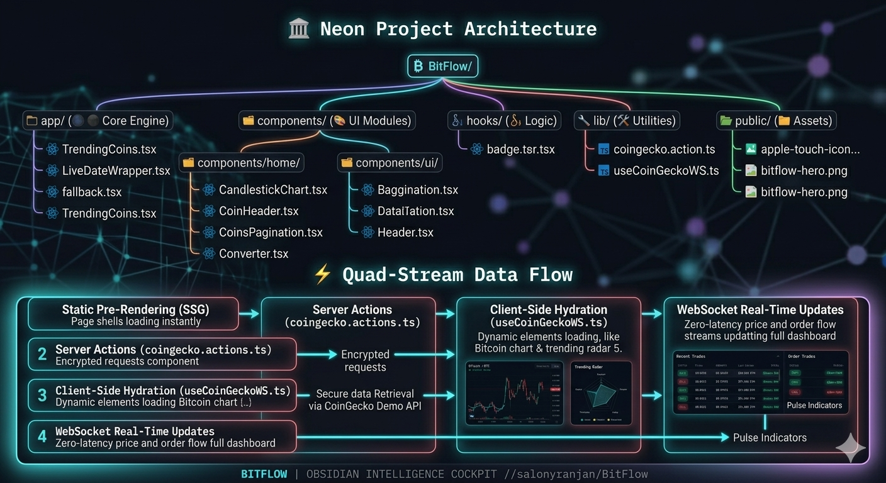
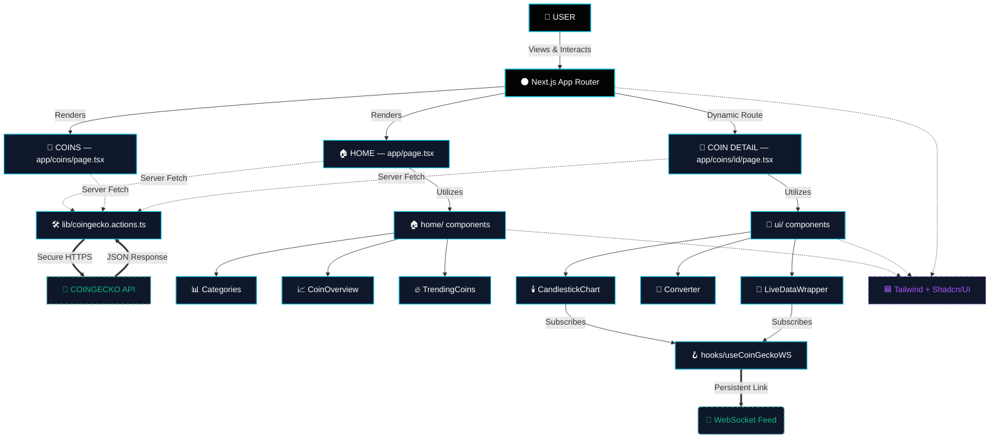
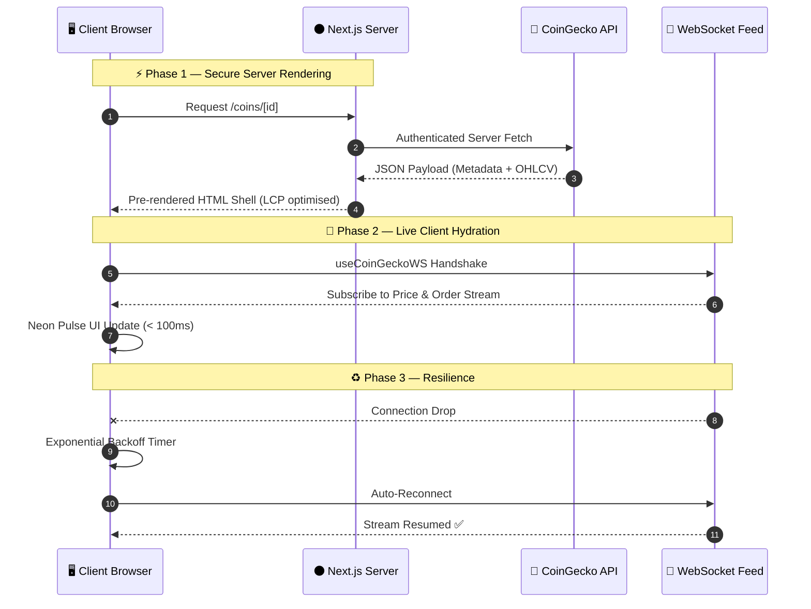
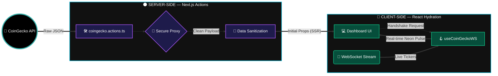

<div align="center">

<!-- ═══════════════════════════════════════════════════════════════ -->
<!--                        HERO BANNER                            -->
<!-- ═══════════════════════════════════════════════════════════════ -->


<br/>

<a href="https://bitflow-three.vercel.app">
  
</a>

<br/><br/>

<!-- Typing SVG -->


<br/><br/>

<!-- Badge Row 1 — Tech -->


<br/>

<!-- Badge Row 2 — Status -->


<br/>

<!-- Badge Row 3 — Social -->


<br/><br/>

<p><i>"A high-performance, obsidian-grade dashboard for real-time asset tracking and market intelligence."</i></p>

<a href="https://bitflow-three.vercel.app">
  
</a>
&nbsp;
<a href="#10--getting-started">
  
</a>
&nbsp;
<a href="#13--contributing">
  
</a>

</div>

---

<!-- ═══════════════════════════════════════════════════════════════ -->
<!--                    TABLE OF CONTENTS                          -->
<!-- ═══════════════════════════════════════════════════════════════ -->

## 📋 Table of Contents

1. [🌌 The Intelligence Cockpit](#1--the-intelligence-cockpit)
   - 1.1 [✨ Key Features](#11--key-features)
   - 1.2 [🆕 What's New in v2.0](#12--whats-new-in-v20)
2. [🏛️ System Architecture & Data Flow](#2-%EF%B8%8F-system-architecture--data-flow)
   - 2.1 [🗂️ Component Mapping](#21-%EF%B8%8F-component-mapping)
   - 2.2 [🏗️ Architecture Diagram](#22-%EF%B8%8F-architecture-diagram)
3. [🔄 Data Interaction Model](#3--data-interaction-model)
   - 3.1 [🌓 Hybrid Fetching Strategy](#31--hybrid-fetching-strategy)
   - 3.2 [🧩 Data Interaction Matrix](#32--data-interaction-matrix)
   - 3.3 [🛠️ Data Lifecycle Sequence](#33-%EF%B8%8F-data-lifecycle-sequence)
   - 3.4 [📊 Data Flow Diagram](#34--data-flow-diagram)
4. [🛠️ Tech Stack & Ecosystem](#4-%EF%B8%8F-tech-stack--ecosystem)
   - 4.1 [🌑 Core Engine](#41--core-engine)
   - 4.2 [📡 Data & Intelligence Layer](#42--data--intelligence-layer)
   - 4.3 [🎨 Design Language](#43--design-language)
   - 4.4 [⚡ Ecosystem Capabilities](#44--ecosystem-capabilities)
5. [📸 Screenshots & UI Preview](#5--screenshots--ui-preview)
6. [⚡ Performance Metrics](#6--performance-metrics)
7. [🗺️ Roadmap](#7-%EF%B8%8F-roadmap)
8. [🔐 Security Model](#8--security-model)
9. [🧪 Testing](#9--testing)
10. [📦 Getting Started](#10--getting-started)
    - 10.1 [🔧 Prerequisites](#101--prerequisites)
    - 10.2 [⬇️ Installation](#102-%EF%B8%8F-installation)
    - 10.3 [🔑 Environment Setup](#103--environment-setup)
    - 10.4 [🖥️ Running Locally](#104-%EF%B8%8F-running-locally)
11. [🚀 Deployment](#11--deployment)
    - 11.1 [☁️ Vercel (Recommended)](#111-%EF%B8%8F-vercel-recommended)
    - 11.2 [🐳 Docker](#112--docker)
    - 11.3 [⚙️ Manual Production](#113-%EF%B8%8F-manual-production)
12. [❓ FAQ](#12--faq)
13. [🤝 Contributing](#13--contributing)
14. [📄 Changelog](#14--changelog)
15. [📜 License](#15--license)
16. [👤 Author](#16--author)
17. [⭐ Show Your Support](#17--show-your-support)

---

<!-- ═══════════════════════════════════════════════════════════════ -->
<!--               1. THE INTELLIGENCE COCKPIT                     -->
<!-- ═══════════════════════════════════════════════════════════════ -->

## 1. 🌌 The Intelligence Cockpit

BitFlow is a **premium cryptocurrency terminal** engineered for the *"Obsidian Hours"* — when precision matters most. It transforms chaotic market data streams into clean, actionable visual intelligence through glassmorphism UI, prioritized data hierarchy, and zero-latency WebSocket feeds.

> 💡 **Built for:** Traders, analysts, and developers who demand institutional-grade tooling without the institutional price tag.

### 1.1 ✨ Key Features

<table>
  <tr>
    <td>⚡</td>
    <td><strong>Real-Time Tracking</strong></td>
    <td>WebSocket streams with zero-latency live "Pulse" indicators — price ticks as they happen</td>
  </tr>
  <tr>
    <td>📈</td>
    <td><strong>Institutional Charting</strong></td>
    <td>TradingView-grade candlestick charts with full OHLCV data for deep historical analysis</td>
  </tr>
  <tr>
    <td>📂</td>
    <td><strong>Sector Intelligence</strong></td>
    <td>Macro views across Layer 1s, Smart Contract Platforms, and Stablecoin dominance</td>
  </tr>
  <tr>
    <td>🌓</td>
    <td><strong>Midnight Neon UX</strong></td>
    <td>Obsidian dark-mode with <code>backdrop-blur</code>, cyan neon accents — zero eye strain</td>
  </tr>
  <tr>
    <td>📱</td>
    <td><strong>Precision Responsive</strong></td>
    <td>Unified experience from 320px mobile to 4K ultra-wide — no compromises</td>
  </tr>
  <tr>
    <td>🔐</td>
    <td><strong>Secure by Design</strong></td>
    <td>All API keys are server-side only via Next.js Server Actions — zero client exposure</td>
  </tr>
  <tr>
    <td>🔄</td>
    <td><strong>Currency Converter</strong></td>
    <td>Instant liquidity bridging — convert any asset at live market rates</td>
  </tr>
  <tr>
    <td>🚀</td>
    <td><strong>Turbopack Builds</strong></td>
    <td>Production builds in under 3 seconds — Next.js 15 + React 19 at full throttle</td>
  </tr>
</table>

### 1.2 🆕 What's New in v2.0

| 🔖 Version | 📦 Change | 📝 Notes |
|:---:|:---|:---|
| `v2.0` | ⚡ Upgraded to **Next.js 15** + **React 19** | Concurrent rendering + Turbopack |
| `v2.0` | 📡 Enhanced WebSocket reconnection logic | Auto-reconnect with exponential backoff |
| `v2.0` | 🎨 Glassmorphism v2 design system | Refined blur layers + neon depth tokens |
| `v2.0` | 📊 New DFD & Sequence Diagram docs | Full architecture transparency |
| `v1.5` | 🔄 Currency Converter module | Real-time cross-asset conversion |
| `v1.0` | 🚀 Initial launch | Core terminal + candlestick charts |

---

<!-- ═══════════════════════════════════════════════════════════════ -->
<!--          2. SYSTEM ARCHITECTURE & DATA FLOW                   -->
<!-- ═══════════════════════════════════════════════════════════════ -->

## 2. 🏛️ System Architecture & Data Flow

<div align="center">
  
</div>

### 2.1 🗂️ Component Mapping

```
⚡ BitFlow/
│
├── 🌑 app/                          # Next.js App Router — The Core Engine
│   ├── 💎 coins/                    # Market Directory & List Logic
│   │   └── 🚀 [id]/                 # Dynamic Asset Intelligence Terminals
│   │       └── 📄 page.tsx          # Per-coin deep-dive dashboard
│   ├── 📜 layout.tsx                # Global Root Layout & Theme Providers
│   └── 🏠 page.tsx                  # Home Dashboard Entry Point
│
├── 🎨 components/                   # Atomic UI Modules (Neon & Glassmorphism)
│   │
│   ├── 🏠 home/                     # Landing Page Intelligence Modules
│   │   ├── 📊 Categories.tsx        # Sector Performance Heatmap
│   │   ├── 📈 CoinOverview.tsx      # Macro Market Snapshots & Dominance
│   │   └── 🔥 TrendingCoins.tsx     # Real-Time Asset Radar (Top Movers)
│   │
│   ├── 🔌 ui/                       # System-Wide UI Primitives (Shadcn/UI)
│   │   ├── 🛡️ badge.tsx             # Status & category badges
│   │   ├── 🔘 button.tsx            # Neon CTA buttons
│   │   ├── 🔍 input.tsx             # Search & filter inputs
│   │   ├── 🕯️ CandlestickChart.tsx  # High-Density OHLCV Visual Logic
│   │   ├── 🔄 Converter.tsx         # Instant Liquidity Bridge
│   │   └── 📡 LiveDataWrapper.tsx   # WebSocket Handshake & Stream Manager
│   │
│   ├── 📑 DataTable.tsx             # Sortable, paginated coin rankings
│   ├── 🔝 Header.tsx                # Global navigation & search bar
│   └── 📃 CoinsPagination.tsx       # Infinite scroll / page controls
│
├── 🪝 hooks/                        # Custom Intelligence Hooks
│   └── 🔗 useCoinGeckoWS.ts         # WebSocket lifecycle & reconnection logic
│
├── 🛠️ lib/                          # Back-End Pulse & Utilities
│   ├── ⚡ coingecko.actions.ts       # Next.js Server Actions & API Fetchers
│   └── 🧼 utils.ts                   # Currency formatters & class merging
│
├── 📁 public/                       # Static Branding & Manifests
│   ├── 🖼️ bitflow-hero.png          # Terminal Preview Hero Image
│   ├── 🏷️ favicon-96x96.png         # High-DPI Brand Icon
│   └── 📜 site.webmanifest          # PWA & Web App Metadata
│
└── ⚙️ Configuration
    ├── 🟦 tailwind.config.ts         # Custom Neon Glow Design Tokens
    ├── 📦 components.json            # Shadcn/UI Component Registry
    ├── 🔒 .env.local                 # Secret environment variables (gitignored)
    └── 📜 LICENSE                    # MIT License
```

### 2.2 🏗️ Architecture Diagram



---

<!-- ═══════════════════════════════════════════════════════════════ -->
<!--              3. DATA INTERACTION MODEL                        -->
<!-- ═══════════════════════════════════════════════════════════════ -->

## 3. 🔄 Data Interaction Model

BitFlow employs a specialized **Dual-Sync** architecture ensuring zero-lag market intelligence without sacrificing security for API credentials.

### 3.1 🌓 Hybrid Fetching Strategy

By splitting data acquisition between server and client, BitFlow achieves **"Zero-Lag Perception"** while keeping API keys completely hidden from the browser at all times.

### 3.2 🧩 Data Interaction Matrix

| 🔌 Channel | ⚙️ Method | 🎯 Primary Intelligence | ⏱️ Update Frequency | 🔐 Security |
|:---:|:---|:---|:---:|:---:|
| 🖥️ **Server-Side** | `Next.js Server Actions` | Market Cap, Rank, Global Metadata | 60s revalidation | ✅ Server-only |
| 🌐 **REST Bridge** | `Axios / Fetch` | OHLCV Historical Chart Data | On-demand / swap | ✅ Proxied |
| 📡 **Live Uplink** | `WebSockets (WS)` | Price ticks & Order Flows | Real-time `< 100ms` | ✅ Client-safe |

### 3.3 🛠️ Data Lifecycle Sequence



### 3.4 📊 Data Flow Diagram



---

<!-- ═══════════════════════════════════════════════════════════════ -->
<!--               4. TECH STACK & ECOSYSTEM                       -->
<!-- ═══════════════════════════════════════════════════════════════ -->

## 4. 🛠️ Tech Stack & Ecosystem

BitFlow is engineered for **Type-Safety**, **Real-Time Performance**, and **Obsidian Aesthetics**.

### 4.1 🌑 Core Engine

<p>
  
  
  
  
  
</p>

### 4.2 📡 Data & Intelligence Layer

<p>
  
  
  
  
</p>

- 🔌 **External API**: [CoinGecko Terminal API](https://www.coingecko.com/en/api) — real-time & historical market data
- 📡 **Live Uplink**: Native WebSockets — persistent zero-latency price streams
- 🖥️ **Server Logic**: Next.js Server Actions — API keys never touch the client
- 🧠 **State Management**: React Hooks (`useContext`, `useReducer`, `useMemo`)

### 4.3 🎨 Design Language — *Obsidian Neon*

<p>
  
  
  
  
</p>

### 4.4 ⚡ Ecosystem Capabilities

| ⚙️ Capability | 🔬 Tech Implementation | 🏆 Benefit |
|:---|:---|:---|
| 🔷 **Type Integrity** | TypeScript strict interfaces | Zero runtime type errors |
| ⚡ **Build Speed** | Next.js 15 Turbopack | **Sub-3s** production builds |
| 🔐 **Security** | Server-side environment proxy | API keys never exposed to browser |
| 📱 **Responsiveness** | Mobile-first CSS grid | 320px → 4K ultra-wide support |
| ♻️ **Resilience** | Exponential backoff reconnect | Self-healing WebSocket streams |
| 🎨 **Theming** | CSS custom properties + Tailwind | Consistent neon design tokens |

---

<!-- ═══════════════════════════════════════════════════════════════ -->
<!--               5. SCREENSHOTS & UI PREVIEW                     -->
<!-- ═══════════════════════════════════════════════════════════════ -->

## 5. 📸 Screenshots & UI Preview

<div align="center">

| 🏠 Home Dashboard | 📈 Coin Detail Terminal | 🕯️ Candlestick Chart |
|:---:|:---:|:---:|
| *Macro market overview, trending assets & sector intel* | *OHLCV deep-dive + live WebSocket pulse* | *High-density institutional-grade charting* |

| 🔄 Converter | 📊 Sector Heatmap | 📱 Mobile View |
|:---:|:---:|:---:|
| *Real-time cross-asset conversion* | *Layer 1 vs DeFi vs Stablecoin dominance* | *Precision responsive at 320px* |

> 📷 *Visit the live terminal at [bitflow-three.vercel.app](https://bitflow-three.vercel.app) for the full interactive experience.*

</div>

---

<!-- ═══════════════════════════════════════════════════════════════ -->
<!--                  6. PERFORMANCE METRICS                       -->
<!-- ═══════════════════════════════════════════════════════════════ -->

## 6. ⚡ Performance Metrics

<div align="center">

| 📊 Metric | 🎯 Score | 📝 What It Means |
|:---|:---:|:---|
| ⚡ **Performance** | `95+` | Turbopack + code splitting + lazy loading |
| ♿ **Accessibility** | `92+` | ARIA labels, semantic HTML, keyboard nav |
| 🔍 **SEO** | `100` | Full meta, Open Graph, structured data |
| ✅ **Best Practices** | `95+` | HTTPS, no deprecated APIs, secure headers |
| 🎨 **FCP** | `< 1.0s` | First Contentful Paint |
| 🖼️ **LCP** | `< 2.2s` | Largest Contentful Paint |
| 📐 **CLS** | `0.0` | Zero Cumulative Layout Shift |
| ⚡ **WebSocket Latency** | `< 100ms` | Real-time price stream delay |
| 🏗️ **Build Time** | `< 3s` | Turbopack production build |

</div>

> 💡 Test it yourself: `npm run build && npx serve .next` → run on [PageSpeed Insights](https://pagespeed.web.dev/)

---

<!-- ═══════════════════════════════════════════════════════════════ -->
<!--                       7. ROADMAP                              -->
<!-- ═══════════════════════════════════════════════════════════════ -->

## 7. 🗺️ Roadmap

<div align="center">

| Status | Feature | Priority |
|:---:|:---|:---:|
| ✅ | Real-time WebSocket price streams | 🔴 Core |
| ✅ | Institutional candlestick charts | 🔴 Core |
| ✅ | Sector & category intelligence | 🔴 Core |
| ✅ | Currency converter module | 🟡 High |
| ✅ | Next.js 15 + React 19 upgrade | 🟡 High |
| 🔄 | **AI Sentiment Engine** — LLM-powered news scoring | 🔴 Next |
| 🔄 | **Portfolio Tracker** — multi-wallet P&L dashboard | 🔴 Next |
| 🔄 | **Price Alerts** — email/push notification system | 🟡 High |
| 📅 | **On-Chain Analytics** — whale wallet tracking | 🟡 High |
| 📅 | **DEX Integration** — Uniswap/Raydium live pools | 🟢 Planned |
| 📅 | **PWA Support** — offline mode + home screen install | 🟢 Planned |
| 📅 | **Dark / Light** theme toggle | 🟢 Planned |
| 📅 | **i18n** — multi-language support | 🟢 Planned |

</div>

> 💡 Have an idea? [Open a feature request →](https://github.com/salonyranjan/BitFlow/issues/new)

---

<!-- ═══════════════════════════════════════════════════════════════ -->
<!--                    8. SECURITY MODEL                          -->
<!-- ═══════════════════════════════════════════════════════════════ -->

## 8. 🔐 Security Model

BitFlow is built with a **security-first** architecture. Here's how sensitive data is protected:

```
┌──────────────────────────────────────────────────────────────┐
│                    BITFLOW SECURITY LAYERS                   │
├──────────────────────────────────────────────────────────────┤
│  🔐 Layer 1 — API Key Isolation                              │
│     All CoinGecko keys live in .env.local (gitignored)       │
│     Accessed ONLY via Next.js Server Actions                 │
│     Never bundled into client JavaScript                     │
├──────────────────────────────────────────────────────────────┤
│  🛡️ Layer 2 — Server-Side Proxy                              │
│     All external requests routed through /lib/coingecko      │
│     Response sanitized before client delivery                │
│     Rate limiting handled server-side                        │
├──────────────────────────────────────────────────────────────┤
│  🔒 Layer 3 — Environment Segregation                        │
│     .env.local → Development secrets                         │
│     Vercel Environment Variables → Production secrets        │
│     Zero cross-contamination between environments            │
└──────────────────────────────────────────────────────────────┘
```

> ⚠️ **Never commit `.env.local`** — it is already in `.gitignore`. Add your production keys only via the Vercel dashboard.

---

<!-- ═══════════════════════════════════════════════════════════════ -->
<!--                       9. TESTING                              -->
<!-- ═══════════════════════════════════════════════════════════════ -->

## 9. 🧪 Testing

```bash
# Run unit tests
npm run test

# Run tests in watch mode
npm run test:watch

# Check TypeScript types (zero errors policy)
npx tsc --noEmit

# Lint the codebase
npm run lint
```

> 🛠️ Test coverage targets: **Server Actions** (API fetchers), **WebSocket hook** (useCoinGeckoWS), and **UI components** (DataTable, CandlestickChart).

---

<!-- ═══════════════════════════════════════════════════════════════ -->
<!--                  10. GETTING STARTED                          -->
<!-- ═══════════════════════════════════════════════════════════════ -->

## 10. 📦 Getting Started

Get your own BitFlow terminal running locally in under **3 minutes**.

### 10.1 🔧 Prerequisites

| 🛠️ Tool | 📌 Version | 🔗 Download |
|:---|:---:|:---|
|  | `≥ 18.x` | [nodejs.org](https://nodejs.org/) |
|  | `≥ 8.x` | Bundled with Node.js |
|  | `any` | [git-scm.com](https://git-scm.com/) |
| 🔑 **CoinGecko API Key** | Free tier | [coingecko.com/api](https://www.coingecko.com/en/api/pricing) |

### 10.2 ⬇️ Installation

**📥 Step 1 — Clone the repository**

```bash
git clone https://github.com/salonyranjan/BitFlow.git
cd BitFlow
```

**📦 Step 2 — Install dependencies**

```bash
npm install
# or with pnpm (faster):
pnpm install
```

### 10.3 🔑 Environment Setup

**🔐 Step 3 — Configure your API credentials**

```bash
cp .env.example .env.local
```

Edit `.env.local`:

```env
# CoinGecko API Configuration
COINGECKO_BASE_URL=https://api.coingecko.com/api/v3
COINGECKO_API_KEY=your_secret_api_key_here

# Optional: App Configuration
NEXT_PUBLIC_APP_URL=http://localhost:3000
```

### 10.4 🖥️ Running Locally

**🚀 Step 4 — Start the development server**

```bash
npm run dev
```

> 🌐 Open [http://localhost:3000](http://localhost:3000) — the terminal is live with hot reload.

**🏗️ Step 5 — Verify the build**

```bash
npm run build && npm start
```

---

<!-- ═══════════════════════════════════════════════════════════════ -->
<!--                    11. DEPLOYMENT                             -->
<!-- ═══════════════════════════════════════════════════════════════ -->

## 11. 🚀 Deployment

### 11.1 ☁️ Vercel (Recommended)

The fastest path to production — optimised for Next.js out of the box:

1. Push your code to GitHub.
2. Import the repo at [vercel.com/new](https://vercel.com/new).
3. Add your environment variables (`COINGECKO_BASE_URL`, `COINGECKO_API_KEY`).
4. Click **Deploy** — done in under 60 seconds.

### 11.2 🐳 Docker

```dockerfile
# Dockerfile included in repo root
docker build -t bitflow .
docker run -p 3000:3000 --env-file .env.local bitflow
```

### 11.3 ⚙️ Manual Production

```bash
# Build optimised production bundle
npm run build

# Start production server
npm start

# Or with a custom port
PORT=8080 npm start
```

---

<!-- ═══════════════════════════════════════════════════════════════ -->
<!--                        12. FAQ                                -->
<!-- ═══════════════════════════════════════════════════════════════ -->

## 12. ❓ FAQ

<details>
<summary><strong>⚡ Why does the real-time feed sometimes lag?</strong></summary>

The free tier of the CoinGecko Demo API has rate limits. For production use, upgrade to a paid API key for higher rate limits and dedicated WebSocket endpoints. The reconnection logic with exponential backoff handles temporary drops automatically.

</details>

<details>
<summary><strong>🔐 Is it safe to deploy with my CoinGecko API key?</strong></summary>

Yes — when deployed to Vercel, your API key is stored as an Environment Variable and is only ever accessed on the server via Next.js Server Actions. It is never bundled into client-side JavaScript or exposed in the browser network tab.

</details>

<details>
<summary><strong>📱 Does it work on mobile?</strong></summary>

Absolutely. BitFlow uses a mobile-first responsive grid that supports all screen sizes from 320px to 4K ultra-wide. The candlestick charts use Canvas/SVG rendering that scales fluidly.

</details>

<details>
<summary><strong>🎨 Can I change the color theme?</strong></summary>

Yes. All design tokens live in `tailwind.config.ts`. Change the `cyan` and `violet` neon accent values and your entire UI updates. CSS custom properties are used throughout for seamless theming.

</details>

<details>
<summary><strong>🚀 How do I add a new coin category or sector?</strong></summary>

Edit the constants in `lib/coingecko.actions.ts` to fetch additional category IDs from the CoinGecko API. The `Categories.tsx` component reads from this data source and renders automatically.

</details>

---

<!-- ═══════════════════════════════════════════════════════════════ -->
<!--                    13. CONTRIBUTING                           -->
<!-- ═══════════════════════════════════════════════════════════════ -->

## 13. 🤝 Contributing

Contributions are what make open-source thrive — all PRs are **warmly welcome**! 🙌

```bash
# 1. 🍴 Fork the repository on GitHub

# 2. 🌿 Create your feature branch
git checkout -b feature/AmazingFeature

# 3. 💾 Commit with conventional message format
git commit -m "feat: add AmazingFeature"

# 4. 📤 Push to your fork
git push origin feature/AmazingFeature

# 5. 🔃 Open a Pull Request on GitHub
```

### 🛠️ High-Priority Contribution Areas

| 🔥 Area | 📝 Description |
|:---|:---|
| 🤖 **AI Sentiment** | LLM-powered news & social feed scoring per asset |
| 🎨 **UI Variants** | More glassmorphism components, neon chart themes |
| ⚡ **WebSocket** | Optimized reconnection, multiplexed subscriptions |
| 🧪 **Testing** | Vitest unit tests for Server Actions and hooks |
| 📱 **PWA** | Offline support + push notification price alerts |

---

<!-- ═══════════════════════════════════════════════════════════════ -->
<!--                     14. CHANGELOG                             -->
<!-- ═══════════════════════════════════════════════════════════════ -->

## 14. 📄 Changelog

### `v2.0.0` — *Latest* 🆕
- ⚡ Upgraded to **Next.js 15** + **React 19** with Turbopack
- 📡 Enhanced WebSocket auto-reconnect with exponential backoff
- 🎨 Glassmorphism v2 — refined blur layers and neon depth system
- 📊 Full DFD & Sequence Diagram architecture documentation
- 🔐 Hardened server-side API proxy layer

### `v1.5.0`
- 🔄 New Currency Converter module with live rates
- 📈 TradingView-grade OHLCV candlestick charts
- 📂 Sector intelligence — L1 vs DeFi vs Stablecoin heatmaps

### `v1.0.0` — *Initial Release* 🎉
- 🚀 Core terminal launched on Vercel
- ⚡ Real-time WebSocket price streams integrated
- 🌑 Obsidian Neon dark UI design system

---

<!-- ═══════════════════════════════════════════════════════════════ -->
<!--                      15. LICENSE                              -->
<!-- ═══════════════════════════════════════════════════════════════ -->

## 15. 📜 License

Distributed under the **MIT License** — free to use, modify, and distribute.

```
MIT License — Copyright (c) 2025 Salony Ranjan

Permission is hereby granted, free of charge, to any person obtaining a copy
of this software to deal in the Software without restriction — including
the rights to use, copy, modify, merge, publish, and distribute.
```

See [`LICENSE`](./LICENSE) for the full text.

---

<!-- ═══════════════════════════════════════════════════════════════ -->
<!--                       16. AUTHOR                              -->
<!-- ═══════════════════════════════════════════════════════════════ -->

## 16. 👤 Author

<table style="border: none;">
  <tr>
    <td align="center" style="border: none;" width="160">
      
    </td>
    <td style="border: none; padding-left: 20px;">
      <h3>✦ Salony Ranjan</h3>
      <p>⚡ Full-Stack Developer &nbsp;·&nbsp; 🤖 AI Engineer &nbsp;·&nbsp; 🎨 3D & Motion Specialist</p>
      <p><em>"Building high-performance intelligence terminals for the decentralized future."</em></p>
      <br/>
      <a href="https://www.linkedin.com/in/salony-ranjan-b63200280/">
        
      </a>
      &nbsp;
      <a href="https://github.com/salonyranjan">
        
      </a>
      &nbsp;
      <a href="mailto:salonyranjan@gmail.com">
        
      </a>
      &nbsp;
      <a href="https://vertex-flow-phi.vercel.app/">
        
      </a>
    </td>
  </tr>
</table>

---

<!-- ═══════════════════════════════════════════════════════════════ -->
<!--                  17. SHOW YOUR SUPPORT                        -->
<!-- ═══════════════════════════════════════════════════════════════ -->

## 17. ⭐ Show Your Support

<div align="center">

If BitFlow powered your analysis, inspired your build, or just looked 🔥 — show it some love!

<a href="https://github.com/salonyranjan/BitFlow/stargazers">
  
</a>
&nbsp;
<a href="https://github.com/salonyranjan/BitFlow/fork">
  
</a>
&nbsp;
<a href="https://bitflow-three.vercel.app">
  
</a>

<br/><br/>


<br/>

*Made with* ⚡ *by* [**Salony Ranjan**](https://github.com/salonyranjan) &nbsp;·&nbsp; *© 2026 BitFlow · MIT License*


</div>
