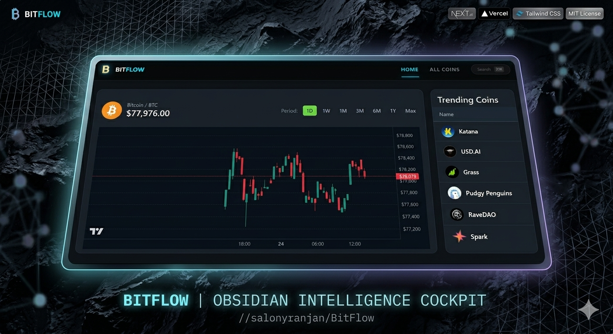

<p align="center">
  <a href="https://bitflow-three.vercel.app">
    
  </a>
</p>

<h1 align="center">⚡ BitFlow | Neon Crypto Intelligence Terminal</h1>

<p align="center">
  <i>A high-performance, obsidian-grade dashboard for real-time asset tracking and market intelligence.</i>
</p>

<p align="center">
  
  
  
  
</p>

---

## 🌌 The Intelligence Cockpit

BitFlow is a premium cryptocurrency terminal designed for the "Obsidian Hours." It transforms complex market data into a clean, actionable visual experience through optimized glassmorphism and prioritized data hierarchy.

### ✨ Key Features

* **⚡ Real-Time Tracking**: Integrated with WebSockets for zero-latency trade streams and live "Pulse" indicators.
* **📈 Institutional Charting**: Custom TradingView-grade candlestick charts for deep historical price analysis.
* **📂 Sector Intelligence**: Macro views across Layer 1s, Smart Contract Platforms, and Stablecoin dominance.
* **🌓 Midnight Neon UX**: A specialized dark-mode interface using `backdrop-blur` and cyan neon accents to reduce eye strain.
* **📱 Precision Responsive**: A unified experience across ultra-wide monitors and mobile devices.

---

## 🛠️ The Tech Stack

- **Framework**: [Next.js 15 (App Router)](https://nextjs.org/)
- **Bundler**: [Turbopack](https://nextjs.org/docs/app/api-reference/turbopack) for 3.0s production builds.
- **Styling**: [Tailwind CSS](https://tailwindcss.com/) with custom neon utility extensions.
- **Data Source**: [CoinGecko API](https://www.coingecko.com/en/api) with strict whitelist parameter handling.
- **Icons**: [Lucide React](https://lucide.dev/)

---

## 🚀 Deployment & Installation

### 1. Clone the repository
```bash
git clone [https://github.com/salonyranjan/BitFlow.git](https://github.com/salonyranjan/BitFlow.git)
cd BitFlow
