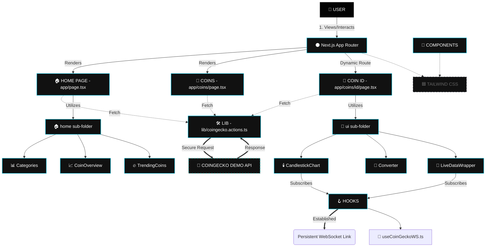
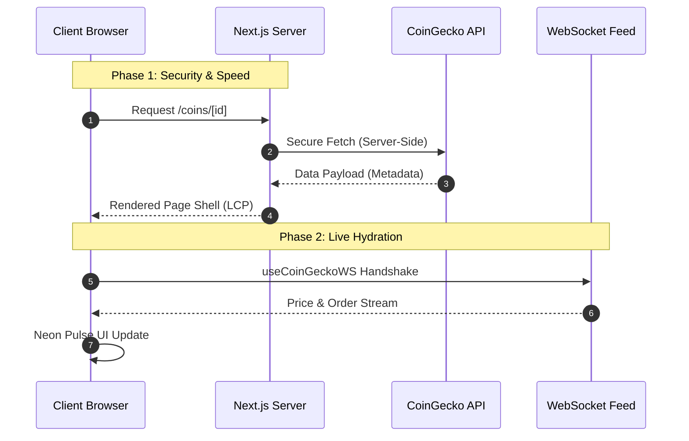
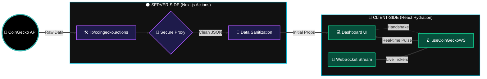

<p align="center">
  <a href="https://bitflow-three.vercel.app">
    
  </a>
</p>

<h1 align="center">⚡ BitFlow | Crypto Intelligence Terminal</h1>

<p align="center">
  <i>A high-performance, obsidian-grade dashboard for real-time asset tracking and market intelligence.</i>
</p>

<p align="center">
  
  
  
</p>

<p align="center">
  
  
  
  
</p>

<p align="center">
  
  
</p>

---
## 🌌 The Intelligence Cockpit

BitFlow is a premium cryptocurrency terminal designed for the "Obsidian Hours." It transforms complex market data into a clean, actionable visual experience through optimized glassmorphism and prioritized data hierarchy.

### ✨ Key Features

* **⚡ Real-Time Tracking**: Integrated with WebSockets for zero-latency trade streams and live "Pulse" indicators.
* **📈 Institutional Charting**: Custom TradingView-grade candlestick charts for deep historical price analysis.
* **📂 Sector Intelligence**: Macro views across Layer 1s, Smart Contract Platforms, and Stablecoin dominance.
* **🌓 Midnight Neon UX**: A specialized dark-mode interface using `backdrop-blur` and cyan neon accents to reduce eye strain.
* **📱 Precision Responsive**: A unified experience across ultra-wide monitors and mobile devices.

---
## 🏛️ System Architecture & Data Flow

<p align="center">
  
</p>

---


### 🏗 Component Mapping

```bash
BitFlow/
├── 🌑 app/                     # Next.js App Router (The Core Engine)
│   ├── 💎 coins/               # Market Directory & List Logic
│   │   └── 🚀 [id]/            # Dynamic Intelligence Terminals
│   ├── 📜 layout.tsx           # Global Root Layout & Providers
│   └── 🏠 page.tsx             # Home Dashboard Entry
│
├── 🎨 components/              # Atomic UI Modules (Neon & Glassmorphism)
│   ├── 🏠 home/                # Landing Page Intelligence
│   │   ├── 📊 Categories.tsx   # Sector Performance Mapping
│   │   ├── 📈 CoinOverview.tsx # Macro Market Snapshots
│   │   └── 🔥 TrendingCoins.tsx# Real-time Asset Radar
│   │
│   ├── 🔌 ui/                  # System-Wide UI Primitives (Shadcn/UI based)
│   │   ├── 🛡️ badge.tsx, button.tsx, input.tsx
│   │   ├── 🕯️ CandlestickChart # High-Density Visual Logic
│   │   ├── 🔄 Converter.tsx    # Instant Liquidity Bridging
│   │   └── 📡 LiveDataWrapper  # WebSocket Handshake & Streams
│   │
│   └── 📑 DataTable.tsx, Header.tsx, CoinsPagination.tsx
│
├── 🪝 hooks/                   # Custom Intelligence Hooks
│   └── 🔗 useCoinGeckoWS.ts    # Real-time WebSocket Logic
│
├── 🛠️ lib/                     # Back-End Pulse & Utilities
│   ├── ⚡ coingecko.actions.ts  # Server Actions & API Fetchers
│   └── 🧼 utils.ts              # Currency Formats & Style Merging
│
├── 📁 public/                  # Static Branding & Manifests
│   ├── 🖼️ bitflow-hero.png     # Terminal Preview Hero
│   ├── 🏷️ favicon-96x96.png    # High-DPI Brand Icon
│   └── 📜 site.webmanifest     # PWA & Web Metadata
│
└── ⚙️ Configuration & Metadata
    ├── 🟦 tailwind.config.ts    # Custom Neon Glow Tokens
    ├── 📦 components.json       # UI Component Registry
    └── 📜 LICENSE               # Project MIT Licensing
```

---

### 🏗 Project Architecture Mermaid Diagram



---

## 🔄 Data Interaction Model

BitFlow employs a specialized Dual-Sync data architecture to ensure low-latency market intelligence without sacrificing server-side security.


### 🌓 The Hybrid Fetching Strategy

BitFlow operates on a specialized **Dual-Sync** data architecture. By splitting data acquisition between the server and the client, the terminal achieves a "Zero-Lag" perception while maintaining absolute security for API credentials.

### 🧩 Data Interaction Matrix

| Channel | Method | Primary Intelligence | Update Frequency |
| :--- | :--- | :--- | :--- |
| **Server-Side** | `Next.js Server Actions` | Market Cap, Rank, & Global Metadata | 60s (Revalidation) |
| **REST Bridge** | `Axios / Fetch` | High-Density Historical Chart Data | On-Demand / Swap |
| **Live Uplink** | `WebSockets (WS)` | Instant Price Shifts & Trade Order Flows | Real-Time (<100ms) |

---

### 🛠 The Data Lifecycle (Sequence)

This model illustrates how BitFlow bridges the gap between static security and real-time interactivity:


---

## 📊 Data Flow Diagram (DFD)

The BitFlow ecosystem is powered by a **Quad-Stream Data Lifecycle**. This diagram illustrates the high-velocity transformation of raw market telemetry into the high-fidelity "Pulse" UI on the client terminal.



---

## 🛠️ Tech Stack & Ecosystem

BitFlow is engineered with a focus on **Type-Safety**, **Real-Time Performance**, and **Obsidian Aesthetics**. The ecosystem is built using the latest industry-standard technologies.

### 🌑 The Core Engine
<p align="left">
  
  
  
  
</p>

### 📡 Data & Intelligence
* **External API**: [CoinGecko Terminal API](https://www.coingecko.com/en/api) for institutional-grade market data.
* **Real-Time Uplink**: Native **WebSockets** for zero-latency price and order-flow synchronization.
* **Server Logic**: **Next.js Server Actions** for secure, server-side data fetching and API key masking.
* **State Management**: React **Hooks** (`useContext`, `useReducer`) for lightweight, high-speed state synchronization.

### 🎨 Design Language (Obsidian Neon)
* **Framework**: [Shadcn/UI](https://ui.shadcn.com/) for high-fidelity, accessible UI primitives.
* **Animation**: [Lucide React](https://lucide.dev/) for dynamic iconography and micro-interactions.
* **Glassmorphism**: Custom **Tailwind CSS** extensions for `backdrop-blur` and neon glow effects.
* **Charts**: Optimized **Canvas/SVG** rendering for high-density price action visualization.

## ⚡ Ecosystem Capabilities

| Capability | Tech Implementation | Benefit |
| :--- | :--- | :--- |
| **Type Integrity** | TypeScript Interfaces | Zero-runtime errors for complex API responses. |
| **Performance** | Next.js Turbopack | **3.0s Production Builds** and instant HMR (Hot Module Replacement). |
| **Security** | Environment Proxy | API keys remain strictly server-side; never exposed to the client. |
| **Responsiveness** | Mobile-First Grid | Seamless trading experience from ultra-wide 4K to mobile displays. |

 **System Status**: 🟢 Optimized for **Next.js 15** and **React 19** Concurrent Rendering.
 
 ---

## 📦 Installation & Setup

Follow these steps to deploy the **BitFlow Terminal** on your local environment. 

### 1. Prerequisites
Ensure you have the following installed:
* **Node.js 18.x** or higher
* **npm** or **pnpm**
* A [CoinGecko API Key](https://www.coingecko.com/en/api/pricing) (Demo keys work perfectly)

### 2. Clone the Repository
```bash
git clone [https://github.com/salonyranjan/BitFlow.git](https://github.com/salonyranjan/BitFlow.git)
cd BitFlow
```
### 3. Install Dependencies
BitFlow uses Next.js 15 and React 19, optimized for high-speed installation.
```bash
npm install
# or
pnpm install
```
### 4. Environment Configuration
Create a .env.local file in the root directory. This project uses Server Actions to keep your keys secure.
```env
# The secure endpoint for market telemetry
COINGECKO_BASE_URL=[https://api.coingecko.com/api/v3](https://api.coingecko.com/api/v3)

# Your private API Key (Keep this out of your git commits!)
COINGECKO_API_KEY=your_secret_api_key_here
```

### 5. Launch the Development Server
Experience the Turbopack speed (up to 700x faster HMR):
```bash
npm run dev
```
🚀 Open http://localhost:3000 to view the terminal.

---
## 🚀 Deployment

BitFlow is optimized for **Vercel's Edge Network**, leveraging Next.js 15 features to ensure global low-latency performance.

### ☁️ Deploying to Vercel (Recommended)

1. **Push your code** to your GitHub repository.
2. **Import Project**: Log in to [Vercel](https://vercel.com) and select your `BitFlow` repo.
3. **Configure Environment Variables**: In the "Environment Variables" section, add the following:
   * `COINGECKO_BASE_URL`: `https://api.coingecko.com/api/v3`
   * `COINGECKO_API_KEY`: `your_secret_api_key_here`
4. **Deploy**: Click the **Deploy** button. Vercel will automatically detect Next.js 15 and optimize the build.

### 🐳 Manual Production Build
If you wish to host BitFlow on your own VPS or a private cloud:

```bash
# Generate a standalone production build
npm run build

# Start the optimized server
npm start
```
---

## 🤝 Contributing

Contributions are what make the open-source community such an amazing place to learn, inspire, and create. Any contributions you make are **greatly appreciated**.

1. **Fork** the Project
2. Create your **Feature Branch** (`git checkout -b feature/AmazingFeature`)
3. **Commit** your Changes (`git commit -m 'feat: Add some AmazingFeature'`)
4. **Push** to the Branch (`git push origin feature/AmazingFeature`)
5. Open a **Pull Request**

### 🛠️ Development Areas
* **AI Integration**: Implementing sentiment analysis for coin social feeds.
* **UI/UX**: Adding more neon "Glassmorphism" variants for dashboard widgets.
* **Performance**: Further optimizing the WebSocket reconciliation logic.

---

## 👤 Author

**Salony Ranjan** *Full-Stack Developer & AI Engineer*

<p align="left">
  <a href="https://www.linkedin.com/in/salony-ranjan-b63200280/">
    
  </a>
  <a href="https://github.com/salonyranjan">
    
  </a>
  <a href="mailto:salonyranjan@gmail.com">
    
  </a>
</p>

---

## ⭐️ Show your support

<p align="center">
  
  <br>
  <i>"Building high-performance intelligence terminals for the decentralized future."</i>
</p>

---
